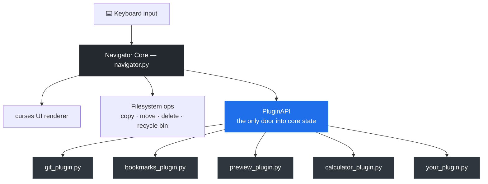
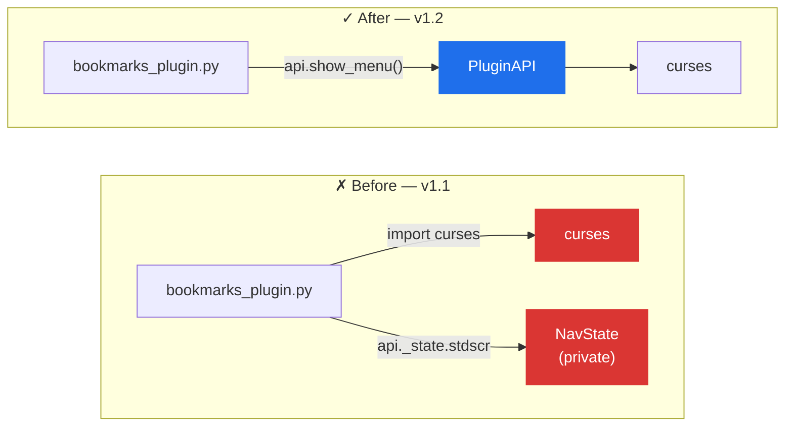

<h1 align="center">◈ Hacker File Navigator ◈</h1>

<p align="center">
  A keyboard-driven terminal file manager built in Python — fast, minimal, and extensible through a live plugin system.
</p>

<p align="center">
  
  
  
  
  
</p>

<p align="center">
  <sub>
    <a href="#features">Features</a> ·
    <a href="#architecture-at-a-glance">Architecture</a> ·
    <a href="#installation">Install</a> ·
    <a href="#keyboard-shortcuts">Shortcuts</a> ·
    <a href="#plugin-system">Plugins</a> ·
    <a href="#changelog">Changelog</a> ·
    <a href="docs/PLUGIN_DEV.md">Plugin Dev Guide</a>
  </sub>
</p>

---

## Features

- **Keyboard-first** — navigate, open, copy, move, rename and delete without touching a mouse
- **Recycle bin** — deleted files are zipped and stored, never permanently lost
- **Live search** — filter the current folder in real time with `/`
- **Visual move** — `Ctrl+X` then `Ctrl+V` opens a full directory browser to pick the destination
- **Plugin system** — drop a `.py` file into `plugins/` and it loads on next start, no config needed
- **Termux ready** — `curses.raw()` mode ensures `Ctrl+C` works as copy, not a kill signal
- **Zero dependencies** — pure Python stdlib only

---

## Architecture at a glance

Plugins never touch the terminal, the filesystem, or app state directly — everything
routes through one `PluginAPI` gate. That's what makes plugins safe to drop in
and hard to crash the app with.



> [!TIP]
> As of the latest update, `PluginAPI.show_menu()` closes the last gap that used
> to tempt plugins into reaching past the API — see [Changelog](#changelog).

---

## Requirements

- Python 3.9 or newer
- A terminal with at least 80×24 size
- One of: `micro`, `nano`, `vi`, or `$EDITOR` set (for opening files)

---

## Installation

**One command — works on Termux and Linux:**

```bash
curl -fsSL https://raw.githubusercontent.com/rhyths-simp/hacker-navir/main/install.sh -o install.sh && bash install.sh
```

The installer will:
- Check Python and git are available
- Clone the repo into `~/.navigator/app/`
- Create the `navir` command so you can launch from anywhere
- Set up your personal plugin folder at `~/.navigator/plugins/`

Then just type:
```bash
navir
```

**On Termux** — if you don't have Python or git yet:
```bash
pkg install python git
```
Then run the install command above.

---

## Updating

```bash
navir --update
```

That's it. Pulls the latest version from GitHub automatically.

---

## Commands

```bash
navir              # launch the file navigator
navir --update     # update to the latest version
navir --version    # show current version
navir --help       # show all commands
```

---

## Keyboard shortcuts

| Key | Action |
|-----|--------|
| `↑ / W` | Move up |
| `↓ / S` | Move down |
| `Enter` | Open file or enter folder |
| `Esc` | Go up to parent folder |
| `/` | Search / filter current folder |
| `Q` | Quit |
| `Ctrl+T` | Context menu (all actions) |
| `Ctrl+N` | New file |
| `Ctrl+F` | New folder |
| `Ctrl+C` | Copy selected |
| `Ctrl+X` | Cut selected (for move) |
| `Ctrl+V` | Paste / move to destination |
| `Ctrl+D` | Delete → recycle bin |
| `Ctrl+R` | Rename |

Plugin shortcuts are added automatically when plugins are installed:

| Key | Plugin | Action |
|-----|--------|--------|
| `Ctrl+G` | git_plugin | Git status for current folder |
| `Ctrl+B` | bookmarks_plugin | Save / jump to folders |
| `Ctrl+P` | preview_plugin | Preview file contents |

---

## Plugin system

Drop any `.py` file into `~/.navigator/plugins/` and it loads on next start:

```python
NAME        = "hello"
VERSION     = "1.0"
DESCRIPTION = "Say hello"

def register(api):
    api.add_keybind("Ctrl+E", "Say Hello", on_ctrl_e)

def on_ctrl_e(api, path, selected_item):
    api.show_status(f"Hello from {path}!")
```

The plugin auto-appears in the startup report and in the `Ctrl+T` menu.
Plugin errors never crash the app — they are logged to `~/.navigator/plugin_errors.log`.

> [!TIP]
> **New:** `api.show_menu(title, rows)` gives plugins an interactive, arrow-key
> navigable popup — pick a bookmark, pick from history, confirm a choice — without
> ever touching `curses` directly. The bundled `bookmarks_plugin.py` was rewritten
> on top of it and is a good reference to copy from.

→ Full guide: [docs/PLUGIN_DEV.md](docs/PLUGIN_DEV.md)

---

## Project structure

```
hacker-navir/
├── navigator.py          # main application
├── plugins/              # bundled plugins
│   ├── git_plugin.py
│   ├── bookmarks_plugin.py
│   └── preview_plugin.py
├── docs/
│   └── PLUGIN_DEV.md     # plugin authoring guide
├── install.sh            # one-command installer
├── README.md
├── LICENSE
└── .gitignore
```

User plugins go in `~/.navigator/plugins/` — never overwritten by updates.

---

## Recycle bin

Deleted items are zipped and stored in `~/recycle_bin/` as timestamped archives:

```
~/recycle_bin/
  myfile.txt_20250328_143022.zip
  old_project_20250327_091155.zip
```

To restore:
```bash
cd ~/recycle_bin
unzip myfile.txt_20250328_143022.zip
```

---

## Changelog

### Unreleased — new plugin API: `show_menu()`

An interactive popup menu plugins can navigate with `↑/↓` (or `W/S`) and pick
from with `Enter` (`Esc` cancels). Rows with a `─`-prefixed left column render
as separators; single-letter row labels (e.g. `"A"`) double as direct shortcut
keys. Full reference: [docs/PLUGIN_DEV.md](docs/PLUGIN_DEV.md#apishow_menutitle-rows-start_idx0--new).

`bookmarks_plugin.py` was bumped to **v1.2** as the reference migration — it
used to hand-roll its own popup with raw `curses` calls reaching into
`api._state.stdscr`. It's now built entirely on `show_menu()`. Here's what
that migration looked like in numbers:

```text
  bookmarks_plugin.py                       before (v1.1)        after (v1.2)
  ────────────────────────────────────────────────────────────────────────────
  Lines of code            v1.1  ██████████████████████████████  182
                            v1.2  ███████████████                  93    ▼ 49%

  Direct `curses.*` calls   v1.1  ██████████████████████████████  13
                            v1.2  ·                                 0    ▼ 100%

  Reaches into `_state`     v1.1  ██████████████████████████████  1 call
  (private, off-limits)     v1.2  ·                                 0 calls  ▼ 100%
```

Same behaviour, less code, and zero private-state access — because the
interactive-menu logic now lives once in `PluginAPI`, instead of being
reinvented (and risking bugs) inside every plugin that needs one:



> [!NOTE]
> If you forked or copied the old `bookmarks_plugin.py`, nothing breaks — it
> keeps working as-is. But any **new** plugin that needs a navigable list
> should use `show_menu()` rather than the old private-state approach.

---

## Contributing

Pull requests welcome. Before submitting:

1. Make sure the app runs on Python 3.9+ with no third-party packages
2. Test on both a standard Linux terminal and Termux if possible
3. If adding a plugin, include `NAME`, `VERSION`, `DESCRIPTION`, and a `register(api)` function
4. Keep `navigator.py` self-contained — no new root files

---

## License

MIT — see [LICENSE](LICENSE)

---

## Thanks

Thanks for using **Hacker File Navigator**! 🎉
