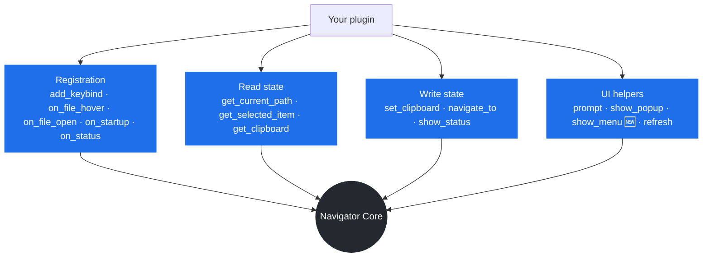
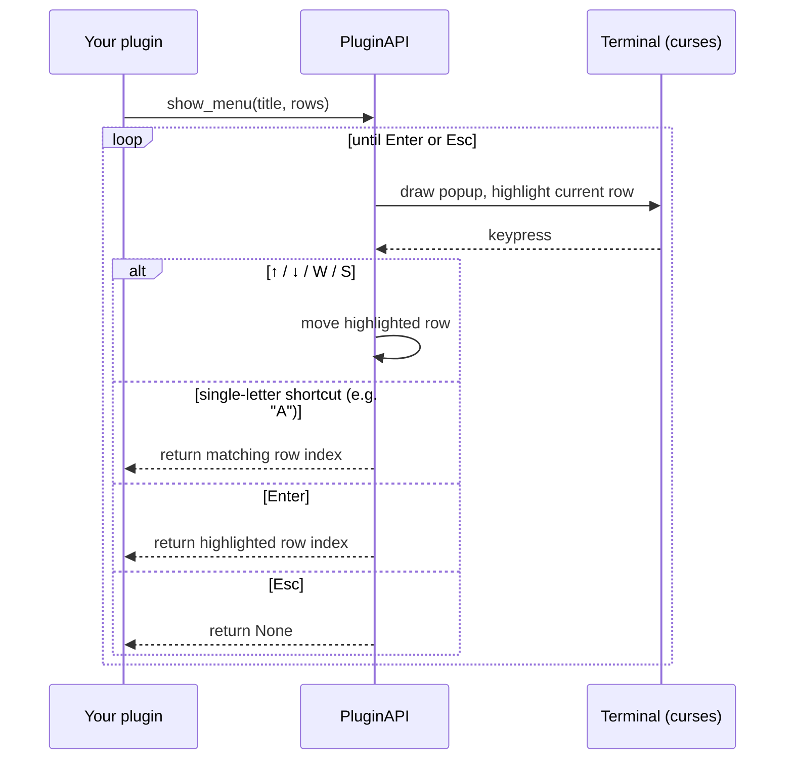
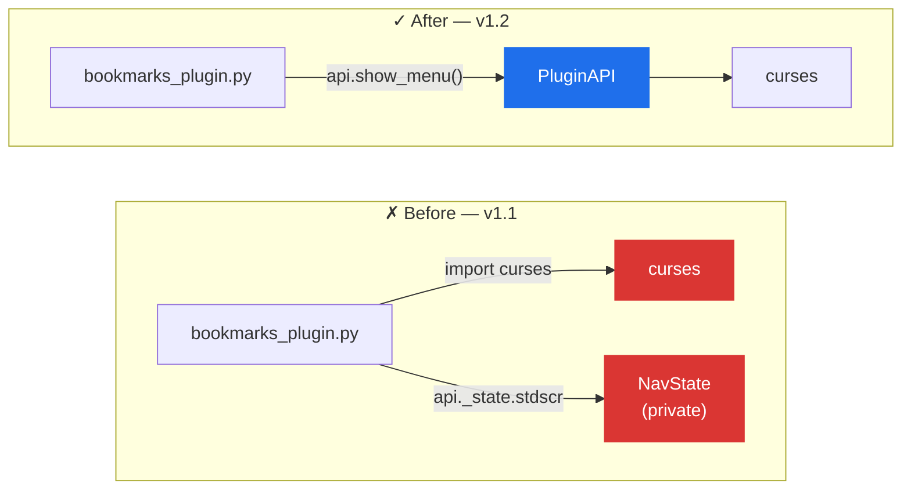

<h1 align="center">🔌 Plugin Development Guide</h1>

<p align="center">
  <sub>Hacker File Navigator — complete reference for plugin authors</sub>
</p>

<p align="center">
  
  
  
</p>

<p align="center">
  <sub>
    <a href="#quick-start">Quick start</a> ·
    <a href="#api-surface-at-a-glance">API surface</a> ·
    <a href="#full-api-reference">API reference</a> ·
    <a href="#apishow_menutitle-rows-start_idx0--new">show_menu()</a> ·
    <a href="#case-study-bookmarks_pluginpy-v11--v12">Case study</a> ·
    <a href="#rules--what-plugins-must-not-do">Rules</a> ·
    <a href="#included-plugins">Included plugins</a>
  </sub>
</p>

> [!TIP]
> **New:** `api.show_menu()` — an interactive, arrow-key-navigable popup menu.
> Jump to the [full reference](#apishow_menutitle-rows-start_idx0--new) or the
> [before/after case study](#case-study-bookmarks_pluginpy-v11--v12) built from
> the `bookmarks_plugin.py` v1.1 → v1.2 rewrite.

---

## Quick start

Create a `.py` file in `plugins/` (bundled) or `~/.navigator/plugins/` (user-installed):

```python
NAME        = "my_plugin"
VERSION     = "1.0"
DESCRIPTION = "One-line description shown at startup"

def register(api):
    api.add_keybind("Ctrl+E", "My Action", on_ctrl_e)

def on_ctrl_e(api, path, selected_item):
    api.show_status(f"Hello from {path}")
```

Restart the navigator. Your plugin appears in the startup report and in the `Ctrl+T` menu automatically.

---

## Plugin file structure

| Field         | Required | Description                          |
|---------------|----------|--------------------------------------|
| `NAME`        | no       | Display name (defaults to filename)  |
| `VERSION`     | no       | Shown in startup popup               |
| `DESCRIPTION` | no       | One-line summary shown at startup    |
| `register(api)` | **yes** | Called once at load — wire hooks here |

---

## API surface at a glance

Everything a plugin can do goes through one of these four doors. There is no
fifth door — anything not on this diagram (`curses`, `NavState`, `sys.exit`)
is off-limits; see [Rules](#rules--what-plugins-must-not-do).



**Quick reference — every method:**

| Category | Method | Returns |
|---|---|---|
| Registration | `add_keybind(key_str, label, callback)` | — |
| Registration | `on_file_hover(fn)` | — |
| Registration | `on_file_open(fn)` | — |
| Registration | `on_startup(fn)` | — |
| Registration | `on_status(fn)` | — |
| Read state | `get_current_path()` | `str` |
| Read state | `get_selected_item()` | `str \| None` |
| Read state | `get_clipboard()` | `(path, is_cut)` |
| Write state | `set_clipboard(path, is_cut=False)` | — |
| Write state | `navigate_to(path)` | — |
| Write state | `show_status(msg, is_error=False)` | — |
| UI helper | `prompt(msg)` | `str` |
| UI helper | `show_popup(title, lines)` | — |
| UI helper | **`show_menu(title, rows, start_idx=0)` 🆕** | `int \| None` |
| UI helper | `refresh()` | — |

---

## Full API reference

### `api.add_keybind(key_str, label, callback)`

Register a keyboard shortcut and add it to the `Ctrl+T` context menu.

```python
api.add_keybind("Ctrl+E", "Open in Editor", my_callback)
# callback signature:
def my_callback(api, path, selected_item):
    ...
```

**`path`** — absolute path of the current directory  
**`selected_item`** — filename with trailing `/` for dirs, or `None` if on a placeholder row

**Reserved keys (core):** `C  D  F  N  R  T  V  X`  
**Safe to use:** `B  E  G  H  I  J  K  L  O  P  U  Y  Z`  
**Avoid:** `W  S  Q` — used for navigation (up / down / quit), even without Ctrl

---

### `api.on_file_hover(fn)`

Show a short tag next to the selected filename on every draw frame.

```python
def my_hover(api, path, item):
    if item.endswith(".py"):
        return "py"    # shown as  [py]  next to the filename
    return None        # show nothing

api.on_file_hover(my_hover)
```

**Return:** string up to 8 characters, or `None`

> [!WARNING]
> Keep this fast — it runs every frame. Cache any slow I/O.

---

### `api.on_file_open(fn)`

Intercept file opens. Return `True` to handle it yourself and skip the default editor.

```python
import os, shutil

IMAGE_EXTS = {".png", ".jpg", ".jpeg", ".gif", ".webp"}

def open_image(api, path, item):
    ext = os.path.splitext(item)[1].lower()
    if ext in IMAGE_EXTS and shutil.which("feh"):
        full = os.path.join(path, item)
        os.system(f"feh {full!r} &")
        return True   # handled — skip default editor
    return False      # fall through to default

api.on_file_open(open_image)
```

---

### `api.on_status(fn)`

Add extra info to the status bar for the currently selected file.

```python
def show_mime(api, path, item):
    import mimetypes
    full = os.path.join(path, item.rstrip("/"))
    mime, _ = mimetypes.guess_type(full)
    return f"type: {mime}" if mime else None

api.on_status(show_mime)
```

**Return:** string or `None`

> [!WARNING]
> Keep this fast — runs every frame.

---

### `api.on_startup(fn)`

Called once after all plugins have loaded. Use for initialisation.

```python
def on_startup():
    os.makedirs(MY_DATA_DIR, exist_ok=True)

api.on_startup(on_startup)
```

---

### Read state

```python
api.get_current_path()      # → str   current directory (absolute)
api.get_selected_item()     # → str | None   filename (trailing / for dirs)
api.get_clipboard()         # → (path, is_cut)  path is None if empty
```

---

### Write state

```python
api.set_clipboard(path, is_cut=False)   # put something on the clipboard
api.navigate_to(path)                   # cd to a different directory
api.show_status("message")              # yellow status bar (one frame)
api.show_status("oops", is_error=True)  # red error message
```

---

### UI helpers

```python
# Inline text input — returns what the user typed, or '' if cancelled
name = api.prompt("Enter file name:")

# Blocking popup — waits for any key to close
api.show_popup("My Plugin", [
    ("Key",    "Value"),
    ("──────", ""),        # separator line
    ("",       "Press any key..."),
])

# Force redraw (rarely needed)
api.refresh()
```

---

### `api.show_menu(title, rows, start_idx=0)` — NEW

Show an **interactive, navigable** popup menu — the user moves through it with
`↑ / ↓` (or `W / S`) and picks with `Enter`; `Esc` cancels.

This is the building block for "do something, then show an updated list, then
let the user act on it again" flows — exactly the pattern bookmarks, favourites,
and history-style plugins need. Before this existed, plugins that wanted a
navigable menu had no choice but to reach into `api._state.stdscr` and draw
one by hand with raw `curses` calls — which is exactly the kind of private-state
access the [Rules](#rules--what-plugins-must-not-do) below forbid. `show_menu()`
closes that gap, so there is no longer a legitimate reason for a plugin to touch
`curses` or `_state` directly.

**How the loop works under the hood:**



Note who's missing from that diagram: your plugin never talks to the terminal.
Only `PluginAPI` does.

```python
rows = [
    ("[1]", "/home/user/projects"),
    ("[2]", "/home/user/notes"),
    ("──────", "──────────────────"),   # left_col starting with '─' = separator
    ("A", "Add current folder"),
]
choice = api.show_menu("  ◈ BOOKMARKS ◈  ", rows)
if choice is None:
    return                       # user pressed Esc

label = rows[choice][0]
if label == "A":
    ...
else:
    dest = rows[choice][1]
    api.navigate_to(dest)
```

**Parameters**

| Param       | Type | Description                                                                 |
|-------------|------|------------------------------------------------------------------------------|
| `title`     | str  | Popup title, shown centered at the top                                      |
| `rows`      | list | `(left_col, right_col)` tuples — same format as `show_popup()`              |
| `start_idx` | int  | Which *selectable* row (0-based, separators don't count) is highlighted first |

**Returns:** the index into `rows` of the chosen entry, or `None` if the user
cancelled with `Esc`.

**Behaviour notes**

- A `left_col` starting with `─` renders as a non-selectable separator and is
  skipped when navigating with the arrow keys.
- `show_menu()` never mutates `rows` or your data for you — if the user adds
  or removes an entry, rebuild `rows` and call `show_menu()` again (typically
  in a `while True:` loop, as shown in `bookmarks_plugin.py`).
- **Single-letter labels double as shortcut keys.** A row labelled `"A"` can be
  picked either by arrowing to it and pressing Enter, or by pressing `A`
  directly — no need to navigate first. Numbered labels like `"[1]"` are more
  than one character, so they're unaffected and only work via arrow+Enter.
  `W`, `S`, and `Esc` stay reserved for menu navigation even if a row happens
  to use one of those letters as its label.

**Worked example — the bookmarks plugin's menu loop:**

```python
def on_ctrl_b(api, path, selected_item):
    bookmarks = _load()

    while True:
        rows   = _build_rows(bookmarks)      # rebuilt fresh every loop
        choice = api.show_menu("  ◈ BOOKMARKS ◈  ", rows)
        if choice is None:
            return                            # Esc

        label = rows[choice][0]

        if label == "A":
            bookmarks.append(path)
            _save(bookmarks)
            api.show_status(f"Bookmarked: {path}")
            return

        elif label == "R":
            # a menu can trigger another menu
            remove_rows = [(f"[{i+1}]", bm) for i, bm in enumerate(bookmarks)]
            remove_rows.append(("Esc", "Cancel"))
            picked = api.show_menu("  Remove which bookmark?  ", remove_rows)
            if picked is not None and remove_rows[picked][0] != "Esc":
                bookmarks.pop(picked)
                _save(bookmarks)
            return

        else:
            # a bookmark row was picked — jump to it
            idx = int(label.strip("[]")) - 1
            api.navigate_to(bookmarks[idx])
            return
```

See the full, current version in `plugins/bookmarks_plugin.py`.

---

## Case study: `bookmarks_plugin.py` v1.1 → v1.2

The bookmarks plugin is the reference migration for `show_menu()` — it's the
plugin that most needed it, since it's the only bundled plugin that used to
draw its own popup by hand. Here's the measured before/after:

```text
  Lines of code            v1.1  ██████████████████████████████  182
                            v1.2  ███████████████                  93    ▼ 49%

  Direct `curses.*` calls   v1.1  ██████████████████████████████  13
                            v1.2  ·                                 0    ▼ 100%

  Reaches into `_state`     v1.1  ██████████████████████████████  1 call
  (private, off-limits)     v1.2  ·                                 0 calls  ▼ 100%
```

Same feature set, roughly half the code, and no more private-state access —
because the interactive-menu logic now lives once in `PluginAPI` instead of
being re-implemented (and re-debugged) inside every plugin that needs one:



> [!NOTE]
> This isn't just a style cleanup: the old approach meant every plugin that
> needed a menu had to get its own curses drawing code right (and keep it in
> sync with the core's colors and box-drawing). Centralizing it in
> `show_menu()` means that work — and any future bug fixes to it — happens
> exactly once, for every plugin, forever.

---

## Rules — what plugins must NOT do

Breaking these will crash or corrupt the navigator.

```python
# ✗ NEVER access NavState directly
api._state.path = "/tmp"     # don't do this

# ✗ NEVER call curses functions yourself
import curses
curses.endwin()              # don't do this
# Need a navigable list/menu instead? Use api.show_menu() — see UI helpers above.

# ✗ NEVER call sys.exit() or os._exit()
sys.exit(0)                  # don't do this

# ✗ NEVER block the main thread for more than ~100ms
time.sleep(5)                # don't do this in a hook

# ✗ NEVER catch and swallow all exceptions silently in hooks
try:
    do_work()
except Exception:
    pass    # errors go unreported — use api.show_status() instead
```

---

## Debugging your plugin

When a plugin hook raises an exception, the navigator:
1. Silently recovers (never crashes the app)
2. Logs the full traceback to `~/.navigator/plugin_errors.log`

To debug:

```bash
# In a second terminal, watch the log live:
tail -f ~/.navigator/plugin_errors.log

# Or dump it after a session:
cat ~/.navigator/plugin_errors.log
```

For errors during `register()` itself (load-time failures), the startup
popup shows a `FAIL` line with a short message.

---

## Performance guidelines

| Hook           | Max time budget | Notes                            |
|----------------|-----------------|-----------------------------------|
| `on_file_hover`| < 1 ms          | Runs every keypress              |
| `on_status`    | < 1 ms          | Runs every keypress              |
| `on_file_open` | any             | Only on Enter                    |
| keybind callback | any           | Only on keypress                 |
| `on_startup`   | any             | Once at startup                  |

For hover/status hooks that need slow I/O (git, network, disk):
**cache the result** keyed on `(path, mtime)`. See `git_plugin.py` for
a worked example.

---

## Worked example — word count in status bar

```python
NAME        = "wordcount"
VERSION     = "1.0"
DESCRIPTION = "Show word count for text files in status bar"

import os

TEXT_EXTS = {".txt", ".md", ".py", ".js", ".ts", ".json", ".yaml", ".yml"}
_wc_cache  = {}   # (path, mtime) → count

def word_count(api, path, item):
    if item.endswith("/"):
        return None
    ext = os.path.splitext(item)[1].lower()
    if ext not in TEXT_EXTS:
        return None

    full = os.path.join(path, item)
    try:
        mtime = os.stat(full).st_mtime
        key   = (full, mtime)
        if key not in _wc_cache:
            with open(full, errors="ignore") as f:
                _wc_cache[key] = len(f.read().split())
        return f"{_wc_cache[key]:,} words"
    except Exception:
        return None

def register(api):
    api.on_status(word_count)
```

---

## Worked example — open images in feh

```python
NAME        = "image_viewer"
VERSION     = "1.0"
DESCRIPTION = "Open images in feh instead of editor"

import os, shutil

IMAGE_EXTS = {".png", ".jpg", ".jpeg", ".gif", ".bmp", ".webp", ".svg"}

def open_hook(api, path, item):
    ext = os.path.splitext(item)[1].lower()
    if ext not in IMAGE_EXTS:
        return False
    if not shutil.which("feh"):
        api.show_status("feh not installed.", is_error=True)
        return True   # still claim it so the editor doesn't open
    full = os.path.join(path, item)
    os.system(f"feh {shlex.quote(full)} &")
    return True

def register(api):
    api.on_file_open(open_hook)
```

---

## Plugin template

Copy this to get started:

```python
"""
your_plugin.py — Short description
────────────────────────────────────
Ctrl+?  →  what it does

Drop into ~/.navigator/plugins/ to install.
"""

import os

NAME        = "your_plugin"
VERSION     = "1.0"
DESCRIPTION = "Short description"


# ── Hooks ─────────────────────────────────────────────────────────────────────

def on_hover(api, path, item):
    """Return a tag string or None."""
    return None

def on_status(api, path, item):
    """Return extra status bar text or None."""
    return None

def on_open(api, path, item):
    """Return True if you handled the open, False to fall through."""
    return False

def on_my_key(api, path, selected_item):
    """Called when Ctrl+? is pressed."""
    api.show_status("Plugin fired!")


# ── Register ──────────────────────────────────────────────────────────────────

def register(api):
    # Remove the lines you don't need
    api.add_keybind("Ctrl+?", "My Action", on_my_key)
    api.on_file_hover(on_hover)
    api.on_status(on_status)
    api.on_file_open(on_open)
```

---

## Included plugins

| File                    | Key    | What it does                                |
|-------------------------|--------|-----------------------------------------------|
| `git_plugin.py`         | Ctrl+G | Git status popup + branch in status bar     |
| `bookmarks_plugin.py`   | Ctrl+B | Save/jump to favourite folders (**v1.2** — now built on `api.show_menu()`) |
| `preview_plugin.py`     | Ctrl+P | Preview text files & image metadata         |
